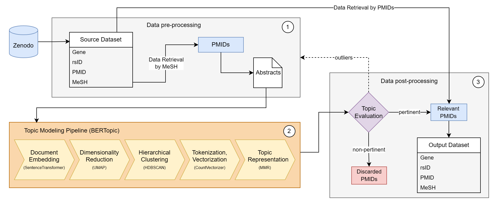

# GRPM BERTopic Analysis
This repository contains the Jupyter notebook `grpm_bertopic.ipynb` which a topic modeling pipeline BERTopic based to unravel hidden topic among Pubmed genetic literature.

## Repository Structure
- `data`: Harvest the data produced during the notebook execution.
- `utlis`: Contains accessory python code.
- `grpm_bertopic.ipynb` : The Jupyter notebook file contains all the steps, code and detailed information about the GRPM BERTopic analysis process.
- `bertopic_tutorial.ipynb`: Jupyter notebook created for educational purposes.

## Requirements
All required libraries and their specific versions used for this project are listed within the `grpm_bertopic.ipynb` notebook. Make sure to install these dependencies before running the notebook.

## Usage
To perform the GRPM BERTopic analysis, follow the steps laid out in the `grpm_bertopic.ipynb` notebook. Each step is well-documented and includes the corresponding code snippet. Following these steps, you'll be able to unravel the intricate connections between genetic variations and MeSH term provided.

The general workflow has been depicted below:

## About GRPM BERTopic Analysis
This analysis leverages the BERTopic pipeline to perform the following steps:
0. It fetches a comprehensive dataset of paper abstracts related to human genetic polymorphisms (GRPM Dataset, based on LitVar and PubMed) 
1. The preprocessing of this dataset is based on custom set of MeSH terms provided by the user (an example could be found in `data/ref-mesh.csv`). It is necessary to get the corpus of paper abstracts for the next step.
2. Utilizes the BERTopic architecture to perform topic modeling on the corpus of abstracts. Employing Hierarchical Clustering, a comprehensive vision of the underlying structure of the topic model is achieved.
3. By performing post-processing, it elucidates certain topics for further detailed exploration of the content and potential implications of the identified genetic influences on the biomedical filed defined by your custom MeSH terms.

If you encounter any issues or have any questions, feel free to open an issue in this repository.

